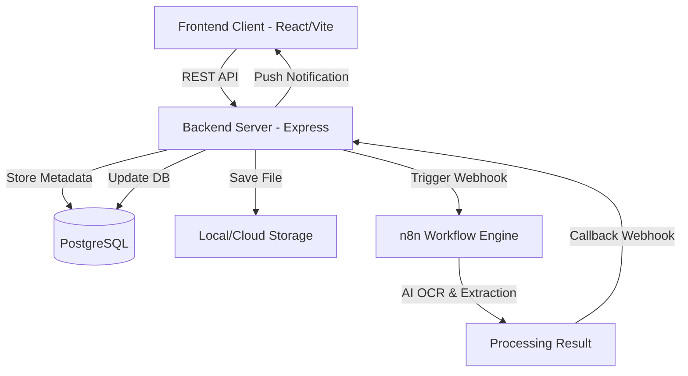

# DocuFlow: Intelligent Document Processing Platform - Project Report

## 1. Executive Summary

**DocuFlow** is a state-of-the-art Intelligent Document Processing (IDP) platform designed to automate the extraction, analysis, and management of specialized documents. By leveraging AI-powered workflows and a robust full-stack architecture, DocuFlow transforms unstructured documents (Invoices, Resumes, Contracts, and Receipts) into actionable structured data.

The platform provides a unified dashboard for real-time analytics, secure document storage, and specialized modules for different business needs—from financial tracking to HR recruitment matching.

---

## 2. Technical Stack

### Backend Infrastructure
- **Runtime**: Node.js (v18+)
- **Framework**: Express.js
- **Database**: PostgreSQL with Sequelize ORM
- **Authentication**: Passport.js with JWT Strategy (Access & Refresh Tokens)
- **File Handling**: Multer for local storage (scalable to S3)
- **Security**: 
  - Express-rate-limit for DDoS protection
  - HMAC SHA-256 for secure Webhook verification
  - Bcrypt for password hashing
  - Helmet for security headers

### Frontend Infrastructure
- **Framework**: React 18+ with TypeScript
- **Build Tool**: Vite
- **Styling**: Tailwind CSS v3
- **Icons**: Lucide React
- **Charts**: Recharts (for analytics and trends)
- **State Management**: React Context API & Custom Hooks
- **Components**: Radix UI (Headless primitives for maximum accessibility)

### Automation & DevOps
- **Workflow Engine**: n8n (Integrated via webhooks)
- **Containerization**: Docker & Docker Compose
- **Hosting**: 
  - Render (Backend)
  - Vercel (Frontend)
- **Testing**: Jest & Supertest (Backend), Vitest (Frontend planned)

---

## 3. System Architecture

DocuFlow follows a modern client-server architecture with an asynchronous processing pipeline powered by an external AI workflow engine.

### The Processing Pipeline
1.  **Upload**: User uploads a document via the React frontend.
2.  **Ingestion**: Backend saves the file, creates a `Document` record with status `pending`.
3.  **Trigger**: An n8n workflow is triggered via a secure webhook.
4.  **Extraction**: AI models analyze the document and extract specific fields based on the type (e.g., Invoice amounts, Resume skills).
5.  **Reconciliation**: The workflow sends a callback to the Backend Webhook.
6.  **Finalization**: Backend populates specialized tables (e.g., `Invoices` or `Resumes`) and marks the document as `completed`.

---

## 4. Key Modules & Features

### 📊 Analytics Dashboard
- **Real-time Overview**: Instant metrics on total documents and processing status.
- **Trend Visualization**: Area charts showing document processing volume over time.
- **Category Breakdown**: Pie charts illustrating document distribution by type.
- **Recent Activity**: A live feed of the latest document uploads and processing updates.

### 📄 Universal Document Management
- **Smart Uploader**: Drag-and-drop interface with progress tracking.
- **Multi-format Support**: PDF, DOCX, PNG, and JPEG.
- **Secure Storage**: Automatic file renaming and path virtualization for data protection.
- **Universal Search**: Filter documents by type, status, or date range.

### 🧾 Financial Modules (Invoices & Receipts)
- **Data Extraction**: Automated extraction of Vendor Name, Date, Tax, and Total Amount.
- **Expense Tracking**: Categorization of receipts into business/personal expenses.
- **Reporting**: Export capabilities to CSV for easy accounting integration.
- **Analytics**: Monthly spending trends and category breakdown for receipts.

### 👔 HR & Legal Modules (Resumes & Contracts)
- **Resume Parsing**: Skill extraction, experience timeline builder, and education parsing.
- **Job Matching**: Intelligent scoring algorithm matching candidates against Job Postings.
- **Contract Risk Analysis**: Identification of "Red Flag" clauses and high-risk terms.
- **Expiry Tracking**: Automated notification system for contract renewal/expiry dates.

---

## 5. API Reference Summary

The Backend provides a comprehensive RESTful API under the `/api` namespace.

| Category | Endpoint | Method | Description |
| :--- | :--- | :--- | :--- |
| **Auth** | `/api/auth/login` | `POST` | Exchange credentials for JWT & Refresh Token. |
| **Docs** | `/api/upload` | `POST` | Multipart upload with auto-trigger for AI. |
| **Docs** | `/api/documents` | `GET` | List documents with pagination/filters. |
| **Stats** | `/api/dashboard/overview`| `GET` | Combined stats for charts. |
| **Webhooks**| `/api/webhooks/*` | `POST` | 5 endpoints for secure callback integration. |
| **Export** | `/api/invoices/export/csv`| `GET` | Download processed data in CSV. |

---

## 6. Security Features

- **Data Isolation**: All document and record queries are scoped by `user_id` to ensure multi-tenant security.
- **Webhook Integrity**: Callback webhooks are verified using HMAC signatures (shared secret between n8n and Backend).
- **Rate Limiting**: Protection against brute-force attacks on auth and heavy processing endpoints.
- **Input Sanitization**: XSS and SQL Injection protection through Sequelize and custom middleware.

---

## 7. Current Project Status

### Backend (90% Complete)
- [x] Database Schema & Migrations
- [x] JWT Auth & Refresh Tokens
- [x] Multer File Infrastructure
- [x] Secure Webhook Framework (HMAC)
- [x] Analytics & Stats APIs
- [x] Export (CSV/PDF) Implementation
- [x] Rate Limiting & Security Hardening
- [ ] Dockerization (In Progress)

### Frontend (60% Complete)
- [x] Core Design System (Tailwind)
- [x] Auth Pages (Login/Register)
- [x] Dashboard with Live Charts
- [x] Upload System with Preview
- [x] Invoices & Resumes List/Details
- [ ] Contracts & Receipts Modules
- [ ] Settings & Profile Management

---

## 8. Development Timeline

- **Week 1 (Days 1-5)**: Foundation, Auth, and File Upload Infrastructure.
- **Week 2 (Days 6-8)**: AI Integration (Webhooks), Specialized Modules, and Analytics.
- **Week 2 (Day 9)**: Security audits, Export features, and performance tuning.
- **Week 2 (Day 10)**: Deployment automation and final polish.

---

## 9. Future Roadmap

1.  **Mobile Support**: Native iOS/Android app for scanning receipts on the go.
2.  **Advanced Match Scoring**: Implementation of Vector Embeddings (Pinecone/Milvus) for semantic resume matching.
3.  **Collaborative Review**: Multi-user permissions for team-based document audit.
4.  **Direct Integrations**: Automated export to QuickBooks, Xero, and Lever.

---
**Report Generated on**: February 10, 2026  
**Status**: ACTIVE DEVELOPMENT  
**Lead Developer**: Anshuman Jagani
